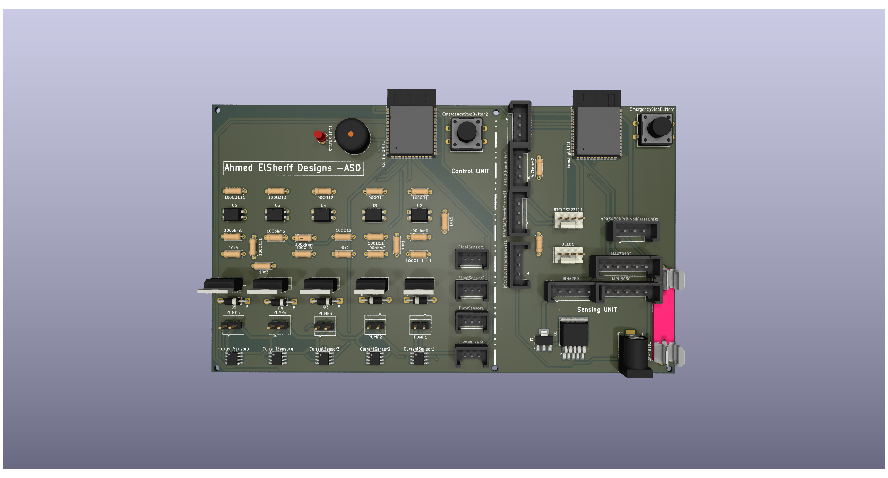
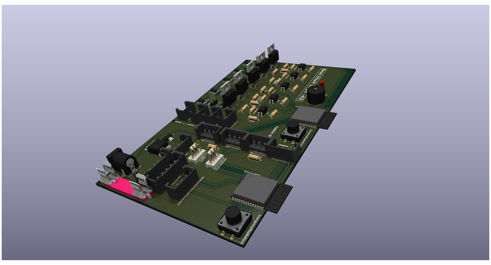
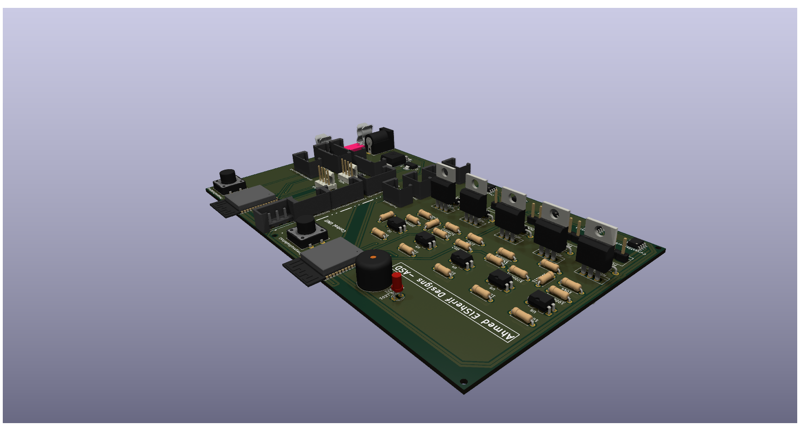
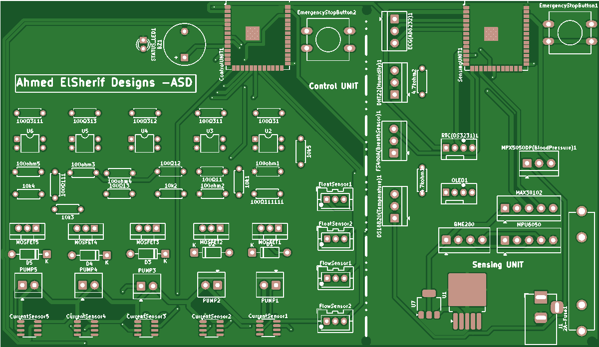

# SmartMed Guardian — AI-based Smart Nursing System

## Overview
SmartMed Guardian is an AI-enabled, IoT-capable nursing system that combines continuous patient monitoring with precision automated medication delivery. The system is composed of two cooperating units — a **Sensor Unit** for real-time physiological data acquisition, and a **Control Unit** for safe, programmable multi-channel medication administration. Data is synced to the cloud for remote monitoring and control.

## System Architecture

### Sensor Unit (Patient Monitoring Module)
- Continuously captures vitals: ECG, heart rate, SpO₂, blood pressure, respiratory rate, glucose readings, and body temperature.
- Uses medical-grade sensors (MAX30102, AD8232, MPX5050DP) and inertial sensing (MPU6050) for motion/respiratory analysis.
- Local pre-processing and secure transmission to the cloud via Wi-Fi (ESP32-S3).
- Emergency alert button for immediate local alarm and remote notification.

### Control Unit (Medication Administration Module)
- Controls up to **5 independent peristaltic pumps** for liquid medication delivery.
- Implements safety checks: current monitoring (ACS712), flow verification (YF-S201), fluid level detection, and optical isolation.
- Receives schedules and dosing commands from the cloud dashboard; supports manual overrides and emergency stop.
- Battery backup and redundant protections to ensure uninterrupted operation.

## Technical Specifications

| Item | Specification |
|------|---------------|
| Primary MCUs | Dual ESP32-S3-WROOM-1 (240 MHz, dual core) |
| Connectivity | Wi-Fi 802.11 b/g/n (cloud sync) |
| Cloud Platform | Firebase Realtime Database (bidirectional sync) |
| Power | 12 V DC input, battery backup supported |
| Monitoring Sensors | MAX30102, AD8232, MPX5050DP, DS18B20, BME280, MPU6050 |
| Medication Control | 5 × peristaltic pumps, ACS712 current sensing, YF-S201 flow sensors |
| Safety | Optical isolation, overcurrent protection, level sensing, watchdog & heartbeat |

## Key Features
- Continuous multi-parameter health monitoring with configurable sampling rates.  
- Edge AI anomaly detection for early-warning alerts and trend analysis.  
- Cloud dashboard for clinicians: real-time view, historical trends, and remote programming of medication schedules.  
- Multi-layer safety: hardware and software checks, emergency stop, and delivery confirmation.  
- Local UI (OLED) and audible/visual alerts for patient/caregiver.

## Clinical Applications
- Chronic disease management (diabetes, hypertension, cardiac care)  
- Post-operative monitoring & medication delivery  
- Elderly care and assisted living  
- Remote clinics and telehealth deployments

## Future Enhancements
- Deeper EHR / hospital system integration (FHIR)  
- Mobile companion app for caregivers & patients  
- Advanced ML models for predictive deterioration detection  
- Encrypted/blockchain-backed audit trail for critical dosing events

## Bill of Materials
📂 [Full BOM / Parts List](./BOM.md)

## Project Images
- 
- 
- 
- 

---

## Author & Contact
**Ahmed Elsherif** — Embedded Systems Engineer  
📧 [Email Me](mailto:ahmedxelsherif@outlook.com)  
🔗 [LinkedIn](https://linkedin.com/in/ahmedxelsherif)
