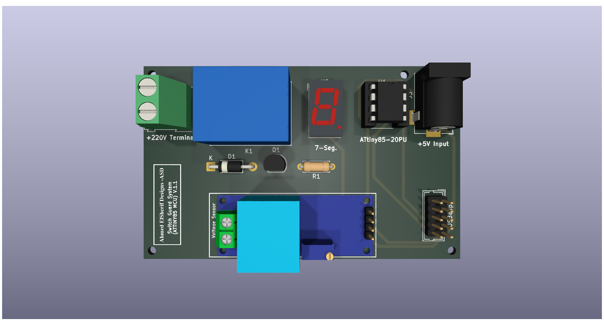
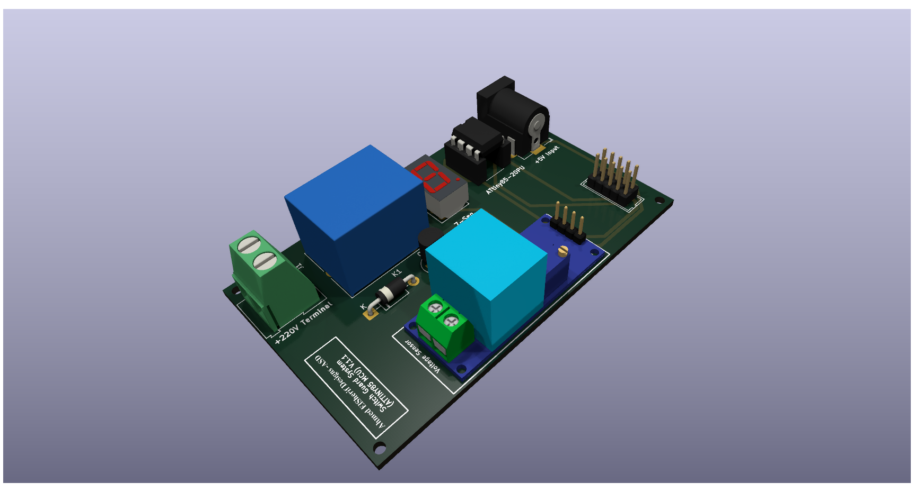
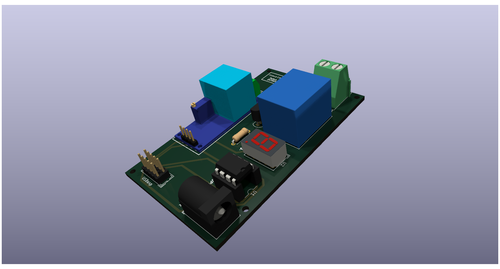

# Voltage Guard Pro – Smart Power Protector

## Overview
The **Voltage Guard Pro** is a compact and intelligent power protection device designed to safeguard household appliances from dangerous voltage fluctuations. Powered by the **ATtiny85 microcontroller**, it continuously monitors AC mains voltage and disconnects appliances when unsafe conditions are detected.

...

📂 [Bill of Materials](./BOM.md)

## Project Images
- 
- 
- 
- 
