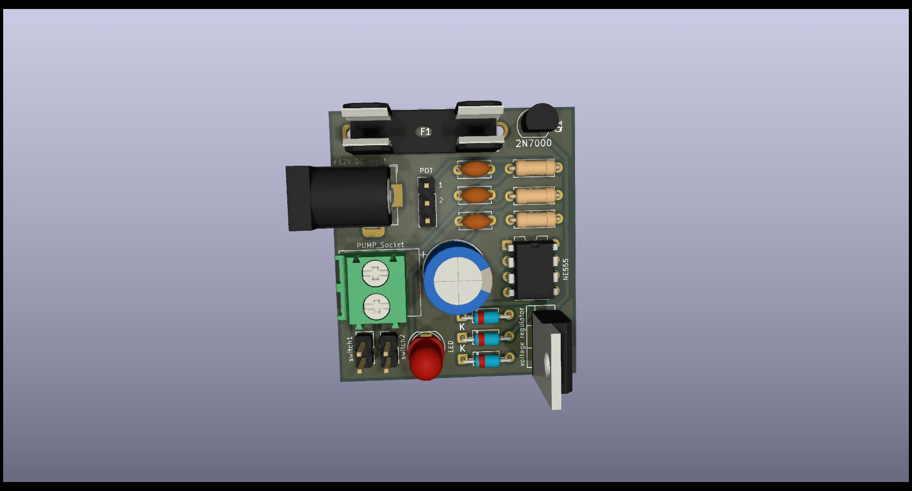
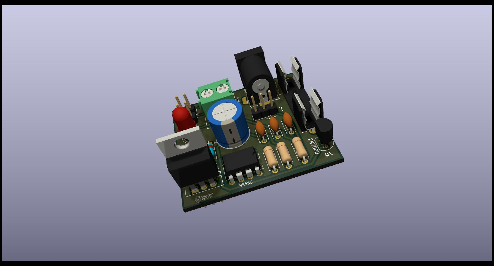
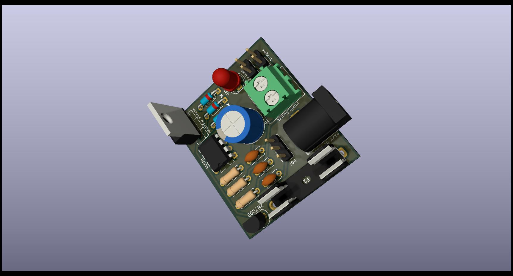
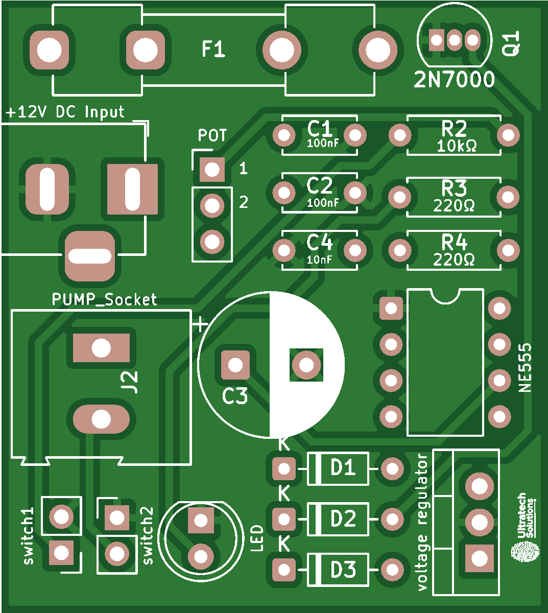

# Smart Bottle-Top Dispenser – Precision Liquid Dispensing System

## 📘 Overview

**Smart Bottle-Top Dispenser** is a precision liquid dispensing system designed for laboratory and cosmetic production environments.  
It automates the process of dispensing exact volumes of liquid directly from reagent bottles, eliminating human error and improving accuracy, repeatability, and safety.

The system uses a **stepper motor** to control a **syringe-type piston pump** that delivers the required volume with sub-milliliter accuracy.  
It is driven by an **ATmega328P** microcontroller and features a **2.4” TFT touch display** for volume input, system configuration, and calibration. Safety mechanisms such as over-current protection, over-travel detection, and voltage regulation are built-in.

With customizable volume presets and automatic priming, Smart Bottle-Top Dispenser is ideal for applications in R&D labs, cosmetic manufacturing, and chemical dosing systems.

---

## ⚙️ Key Features

- 🧪 **Precision dispensing** with ±0.5% accuracy  
- 📲 **Touch interface** for volume setting and calibration  
- 🔁 **Automatic priming and refill**  
- 📦 **Custom volume presets** (1 mL – 100 mL)  
- 🛡️ **Safety protections** (over-voltage, over-travel, surge)  
- 🪶 Compact, modular design for easy bottle mounting  
- 🧰 Compatible with laboratory glassware and standard reagent bottles  

---

## 🖼️ Project Images

- 
- 
- 
- 

---

## 🧰 Bill of Materials  
📂 [View BOM here](./BOM.md)

---

## 🧪 Technical Specs

| Parameter | Value |
|----------|--------|
| Input Voltage | 12V DC |
| MCU | ATmega328P-AU |
| Motor | NEMA17 Stepper |
| Motor Driver | A4988 |
| Display | 2.4” TFT Touch (MPI5008) |
| Pump Type | Syringe-type piston |
| Dispensing Volume | 1 mL – 100 mL |
| Accuracy | ±0.5% |
| Communication | UART / I2C (optional for future expansion) |
| Protection | TVS diode, reverse polarity, MOV |
| PCB Version | THT (Prototype) / SMD (Production) |

---

## 📬 Author & Contact

👤 **Ahmed Elsherif** – Embedded Systems Engineer  
📧 [Email Me](mailto:ahmedxelsherif@outlook.com)  
🔗 [LinkedIn](https://linkedin.com/in/ahmedxelsherif)
