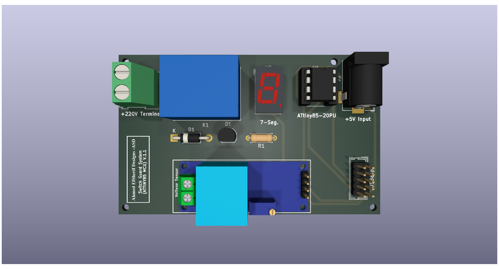
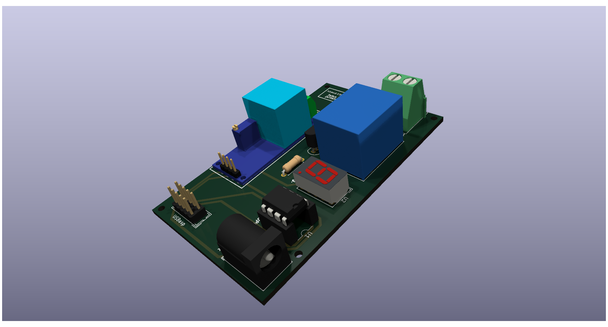
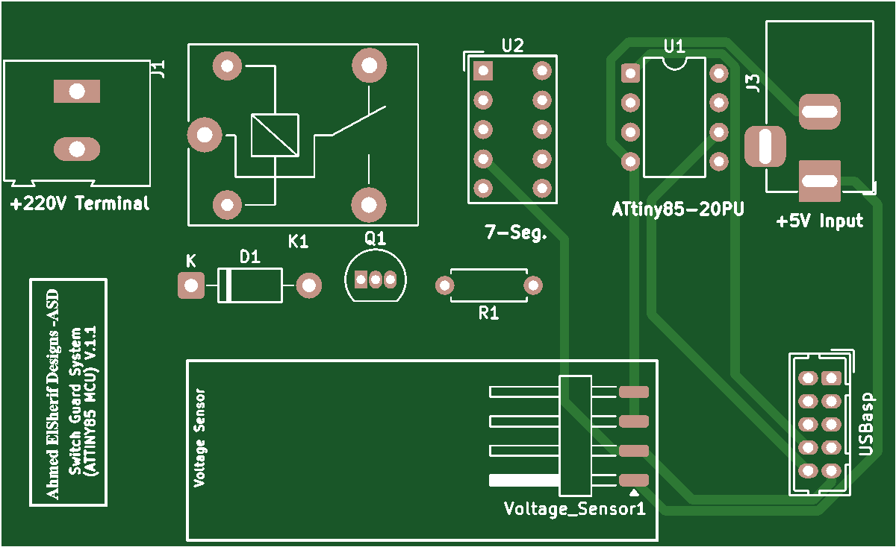

# Voltage Guard Pro – Smart Power Protector

## 📘 Overview

**Voltage Guard Pro** is a smart, low-cost power protection device designed to safeguard household appliances from dangerous voltage fluctuations.  
Built around the **ATtiny85 microcontroller**, it continuously monitors the AC mains voltage and instantly disconnects connected devices when the voltage goes below **190V** or exceeds **250V** — protecting sensitive electronics from damage.

The device uses a **ZMPT101B voltage sensor** for accurate measurements and a **SANYOU SRD relay** for fast switching. It features a dual 7-segment display showing real-time voltage readings and automatically restores power once voltage returns to a safe range.

With its compact size and cost-effective design, Voltage Guard Pro is ideal for protecting TVs, refrigerators, air conditioners, and other sensitive electronics from Egypt’s frequent voltage instability.

---

## ⚙️ Key Features

- 🔌 **Automatic power cut-off** below 190V or above 250V  
- ⚡ **Real-time voltage display** on dual 7-segment modules  
- 🧠 **Fast response time** with ATtiny85 microcontroller  
- 🔁 **Auto-restart** when voltage returns to normal  
- 🛡️ **Relay protection + surge protection (MOV)**  
- 🪶 Compact, affordable, and easy to install  

---

## 🖼️ Project Images

- 
- 
- 
- 

---

## 🧰 Bill of Materials  
📂 [View BOM here](./BOM.md)

---

## 🧪 Technical Specs

| Parameter | Value |
|----------|--------|
| Input Voltage | 220V AC |
| Safe Operating Range | 190V – 250V |
| MCU | ATtiny85-20PU |
| Display | Dual 7-Segment |
| Relay | SANYOU SRD-05VDC-SL-C |
| Sensor | ZMPT101B AC Voltage Sensor |
| Protection | MOV + Fuse + Flyback Diode |
| Response Time | < 50 ms |

---

## 📬 Author & Contact

👤 **Ahmed Elsherif** – Embedded Systems Engineer  
📧 [Email Me](mailto:ahmedxelsherif@outlook.com)  
🔗 [LinkedIn](https://linkedin.com/in/ahmedxelsherif)
